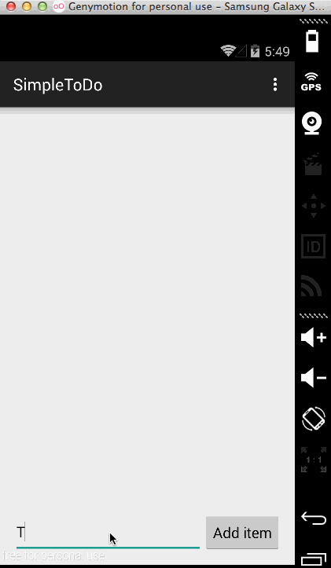

# CodePath Prework Simple ToDo Application

This is a simple Android ToDo Application that lets users add, delete, and edit tasks.

Completed user stories: 

 * [x] Required: User can add tasks. 
 * [x] Required: User can long click on a task to delete it.
 * [x] Required: User can click on a task to launch the edit screen.

Walkthrough of all user stories:

GIF created with [LiceCap](http://www.cockos.com/licecap/).
